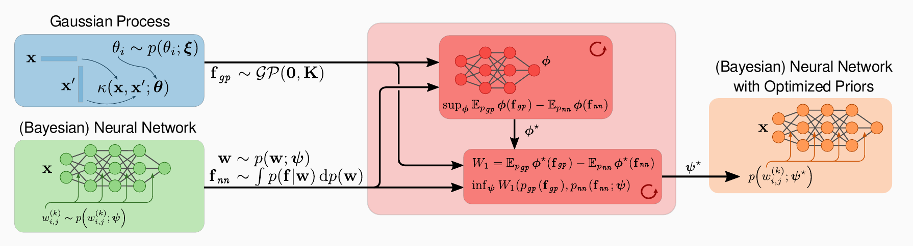

# All You Need is a Good Functional Prior for Bayesian Deep Learning

Code for the paper *"All You Need is a Good Functional Prior for Bayesian Deep Learning"*.



The code is under refactoring, feel free to contact me via email ([ba-hien.tran@eurecom.fr](ba-hien.tran@eurecom.fr)) if you have any issues or questions.

## Setup
We assume `python3.6` or `python3.7` since the package was developed with those versions. To install the package with `pip3` please clone this repository and then run the following
```
pip3 install .
```

## Example Usage

The subfolder `notebooks` contains jupyter notebooks to run experiments with regression and classification tasks. They also show how to use this package. Here, we included some demos as follows

- `1D_regression_Gaussian_prior.ipynb`: Comparison between `FG` and `GPiG` priors on a 1D regression data.
- `1D_regression_hierarchical_prior.ipynb`: Comparison between `FH` and `GPiH` priors on a 1D regression data set.
- `1D_regression_norm_flow_prior.ipynb`: Comparison between `Fixed NF` and `GPiNF` priors on 1D regression data.
- `2D_classification.ipynb`: The effect of using different configurations of the target GP prior to the predictive posterior on a 2D classification task.
- `2D_classification_hierarchical_gp_prior.ipynb`: The effect of using a target hierarchical-GP prior to the predictive posterior on a 2D classification task.
- `uci_regression.ipynb`: Comparison between `FG` and `GPiG` priors on a UCI data set.


## Citation

When using this package in your work, please consider citing our paper

```
@article{Tran2022,
  author    = {Tran, Ba-Hien and Rossi, Simone and Milios, Dimitrios and Filippone, Maurizio},
  title   = {{All You Need is a Good Functional Prior for Bayesian Deep Learning}},
  journal = {Journal of Machine Learning Research},
  volume  = {23},
  pages   = {1--56},
  year    = {2022}
}
```